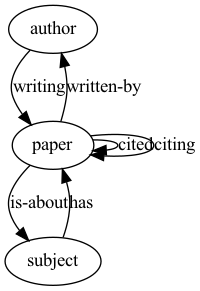

## Creating Graph data

Very simple example below


```python
# Each value of the dictionary is a list of edge tuples.
# Nodes are integer IDs starting from zero. Nodes IDs of different types have
# separate countings.
import torch
import dgl
## /Users/lrabalski1/miniforge3/envs/tensorflow_mac/lib/python3.8/site-packages/scipy/__init__.py:146: UserWarning: A NumPy version >=1.16.5 and <1.23.0 is required for this version of SciPy (detected version 1.23.4
##   warnings.warn(f"A NumPy version >={np_minversion} and <{np_maxversion}"
ratings = dgl.heterograph(
    {('user', '+1', 'movie') : [(0, 0), (0, 1), (1, 0)],
     ('user', '-1', 'movie') : [(2, 1)]})
ratings

## Graph(num_nodes={'movie': 2, 'user': 3},
##       num_edges={('user', '+1', 'movie'): 3, ('user', '-1', 'movie'): 1},
##       metagraph=[('user', 'movie', '+1'), ('user', 'movie', '-1')])
```

### saving graph

In order to save graph as object, very convenient method is to use
`pickle.`


```python
import pickle

output_file = 'builded_graph.pkl'
directory = 'input/'
with open(directory + output_file, 'rb') as f:
    g = pickle.load(f)


#loading saved graph
with open(directory  + output_file, 'rb') as f:
    sp_matrix = pickle.load(f)

```

To create a more realistic heterograph let's use the ACM dataset. \##
Graphs Dataset can be downloaded from
[here](https://www.aminer.org/citation). It's stored in mat (matrix)
object. Within which we can find object/matrices stored in a
`compresed sparsed` format. More about further.


```python
import scipy.io
import urllib.request

data = scipy.io.loadmat(data_file_path+'ACM.mat')

```

### compresed sparsed matrix

Many different ways to store `sparsed matrices` may be find in scipy
[documentation](https://docs.scipy.org/doc/scipy/reference/sparse.html).

For us most important will be `csr_matrix` and `csc_matrix`.

CSC format is almost identical, except that values are indexed first by
column with a column-major order. Usually, the CSC is used when there
are more rows than columns. On the contrary, the CSR works better for a
'wide' format. So, her is taking CSR as an example here.

Below short example how `sparsed matrices` can be handle with `scipy`
package.


```python
import numpy as np
from scipy.sparse import csr_matrix, csc_matrix
arr = np.array([[0, 0, 0], [0, 0, 1], [1, 2, 0]])

arr_csr = csr_matrix(arr)
arr_csc = csc_matrix(arr)

print(type(arr_csr))
## <class 'scipy.sparse.csr.csr_matrix'>
print(type(arr_csc))

# `CSC` format is almost identical, except that values are indexed first by column with a column-major order. Usually, the `CSC` is used when there are more rows than columns. On the contrary, the `CSR` works better for a ‘wide’ format. So, her is taking CSR as an example here
## <class 'scipy.sparse.csc.csc_matrix'>
print(arr_csr)
##   (1, 2)	1
##   (2, 0)	1
##   (2, 1)	2
print(arr_csc)

# however in order to get access ti those indexes need to use method to_coo.
##   (2, 0)	1
##   (2, 1)	2
##   (1, 2)	1
arr_csr.tocoo().row
## array([1, 2, 2], dtype=int32)
arr_csr.tocoo().col

#Viewing stored data (not the zero items) with the data property
## array([2, 0, 1], dtype=int32)
print(arr_csr.data)
## [1 1 2]
print(arr_csc.data)

#Counting nonzeros with the count_nonzero() method:
## [1 2 1]
print(arr_csr.count_nonzero())
## 3
print(arr_csc.count_nonzero)
## <bound method _data_matrix.count_nonzero of <3x3 sparse matrix of type '<class 'numpy.int64'>'
## 	with 3 stored elements in Compressed Sparse Column format>>
print(arr_csr.toarray())
## [[0 0 0]
##  [0 0 1]
##  [1 2 0]]
print(arr_csc.todense())

## [[0 0 0]
##  [0 0 1]
##  [1 2 0]]
```

### SP matrix methods

#### bipartite_from_scipy


```python
import scipy.sparse as sp

sp_matrix = data['PvsA']
print(type(sp_matrix))
## <class 'scipy.sparse.csc.csc_matrix'>
print('#Papers:', sp_matrix.shape[0])
## #Papers: 12499
print('#Authors:',sp_matrix.shape[1])
## #Authors: 17431
print('#Links:', sp_matrix.nnz)

# ways of populating graph with coo_matrix
## #Links: 37055
pp_g = dgl.bipartite_from_scipy(sp_matrix, utype='paper', etype='written-by', vtype='author')

pp_g.is_homogeneous
## False
print(pp_g.number_of_nodes())
## 29930
print(pp_g.number_of_edges())
## 37055
print(pp_g.successors(3))
## tensor([ 4295, 13161])
print('Node types:', pp_g.ntypes)
## Node types: ['paper', 'author']
print('Edge types:', pp_g.etypes)
## Edge types: ['written-by']
print('Canonical edge types:', pp_g.canonical_etypes)
## Canonical edge types: [('paper', 'written-by', 'author')]
```

In order to visualize the interactions (edges) between nodes let use
following function.


```python
import pygraphviz as pgv
def plot_graph(nxg, plot_name):
    ag = pgv.AGraph(strict=False, directed=True)
    for u, v, k in nxg.edges(keys=True):
        ag.add_edge(u, v, label=k)
    ag.layout('dot')
    ag.draw(plot_name+'.png')
```


```python
plot_graph(nxg=pp_g.metagraph(),plot_name='simple_graph')
```


#### heterograph

Using ACM dataset


```python
import torch

# Unfortunately following code no longer works
G = dgl.heterograph({
        ('paper', 'written-by', 'author') : data['PvsA'],
        ('author', 'writing', 'paper') : data['PvsA'].transpose(),
        ('paper', 'citing', 'paper') : data['PvsP'],
        ('paper', 'cited', 'paper') : data['PvsP'].transpose(),
        ('paper', 'is-about', 'subject') : data['PvsL'],
        ('subject', 'has', 'paper') : data['PvsL'].transpose(),
    })

# we need to a little bit tweak the code the get the same result as above.
## Error in py_call_impl(callable, dots$args, dots$keywords): dgl._ffi.base.DGLError: dgl.heterograph no longer supports graph construction from a SciPy sparse matrix, use dgl.from_scipy instead.
G = dgl.heterograph({
        ('paper', 'written-by', 'author') : 
          (torch.tensor(data['PvsA'].tocoo().col),torch.tensor(data['PvsA'].tocoo().row )),
         ('author', 'writing', 'paper') : 
           (torch.tensor(data['PvsA'].tocoo().row) ,torch.tensor(data['PvsA'].tocoo().col)),
        ('paper', 'citing', 'paper') : 
          (torch.tensor(data['PvsP'].tocoo().col),torch.tensor(data['PvsP'].tocoo().row )),
        ('paper', 'cited', 'paper') : 
          (torch.tensor(data['PvsP'].tocoo().row) ,torch.tensor(data['PvsP'].tocoo().col)),
        ('paper', 'is-about', 'subject') : 
          (torch.tensor(data['PvsL'].tocoo().col),torch.tensor(data['PvsL'].tocoo().row )),
        ('subject', 'has', 'paper') : 
          (torch.tensor(data['PvsL'].tocoo().row) ,torch.tensor(data['PvsL'].tocoo().col))
    })
  
plot_graph(nxg=G.metagraph(),plot_name='more_complicated_graph')

```



### pandas method 

On [github
repository](https://github.com/yoonjong12/pinsage/blob/main/builder.py)
we can find a method allowing for building graphs using pandas
dataphrame.


```python
import sys
import numpy as np
import pandas as pd
sys.path.insert(1, repo_directory)
from builder import PandasGraphBuilder

users=pd.DataFrame(data=range(1,101), columns=['user_id'])
products=pd.DataFrame(data=range(1,50), columns=['product_id'])
interactions=pd.DataFrame(data={
  'user_id': np.random.choice(users.user_id,1000,replace=True),
  'product_id' :np.random.choice(products.product_id,1000,replace=True)}
  )


graph_builder = PandasGraphBuilder()
graph_builder.add_entities(users, 'user_id', 'user')
graph_builder.add_entities(products, 'product_id', 'product')

graph_builder.add_binary_relations(interactions, 'user_id','product_id', 'interaction')
graph_builder.add_binary_relations(interactions, 'product_id','user_id', 'interaction-by')

print('starting graph building')
## starting graph building
g = graph_builder.build()

plot_graph(nxg=g.metagraph(),plot_name='pandas_graph')
```


