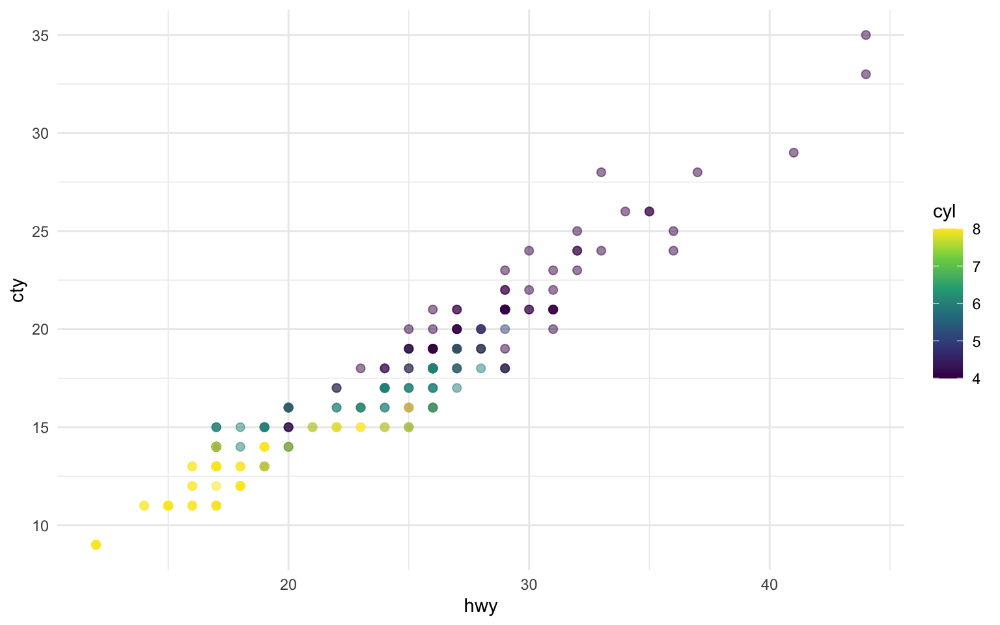
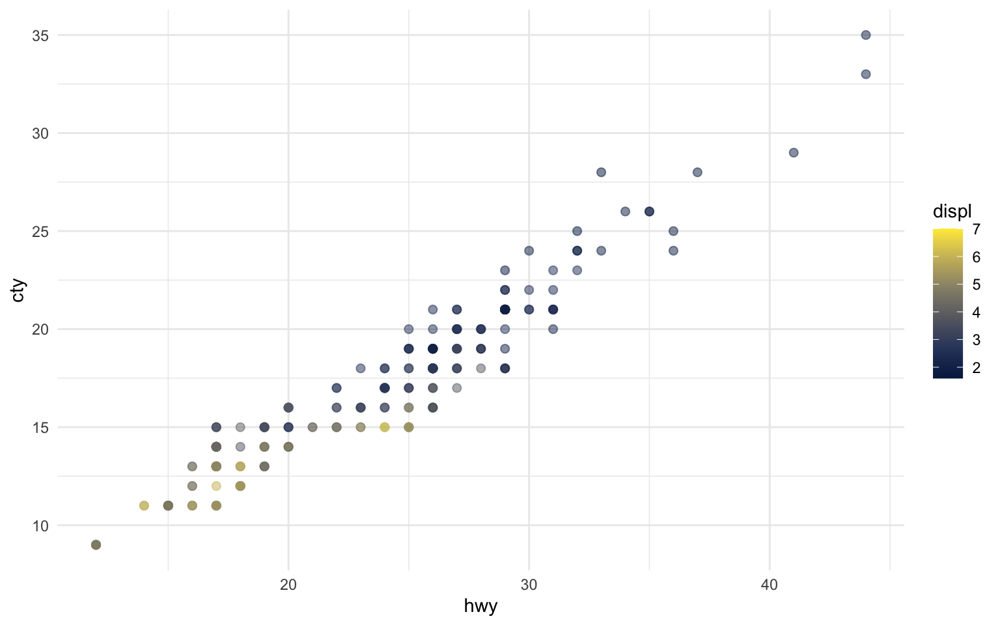

There are 234 observations in our data.

The average city mileage of the cars in our data is 16.86 and the average highway mileage is 23.44.

The plots in Figure **?@fig-mpg** show the relationship between city and highway mileage for 38 popular models of cars.
In Figure [Figure 1](#fig-mpg-1) the points are colored by the number of cylinders while in Figure [Figure 2](#fig-mpg-2) the points are colored by engine displacement.

``` r
ggplot(mpg, aes(x = hwy, y = cty, color = cyl)) +
  geom_point(alpha = 0.5, size = 2) +
  scale_color_viridis_c() +
  theme_minimal()

ggplot(mpg, aes(x = hwy, y = cty, color = displ)) +
  geom_point(alpha = 0.5, size = 2) +
  scale_color_viridis_c(option = "E") +
  theme_minimal()
```

<figure>

<figcaption aria-hidden="true">Figure 1: Color by number of cylinders</figcaption>
</figure>

<figure>

<figcaption aria-hidden="true">Figure 2: Color by engine displacement, in liters</figcaption>
</figure>

City and highway mileage for 38 popular models of cars.
